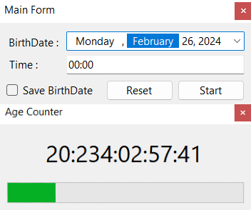

# ⏳Age Counter

## 📄Overview
The Age Calculator is a simple Windows desktop application designed to calculate and display a person's age based on their birthdate.

## 🔍Features
- Input fields for entering the birthdate (day, month, year).
- Option to save the calculated age to a text file.
- Progress bar

## ⚙️System Requirements
- Windows operating system (Windows 7 or later)
- .NET 8.0 or higher

## 📥Installation
1. Download the Age Counter from the Releases section of this repository.
2. Run the app.

## 💻Usage
1. Enter your birthdate.
2. Click the "Start" button.
3. Your age will be displayed in the designated form.

## Screenshots

## 💢How to Run Automatically
1. Press Win key + R.
2. Type shell:startup and press OK.
3. Copy the .exe file of Age Counter in the directory.
